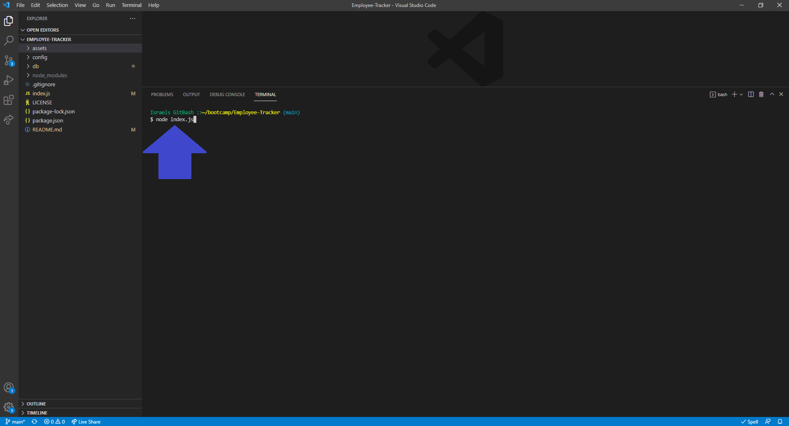
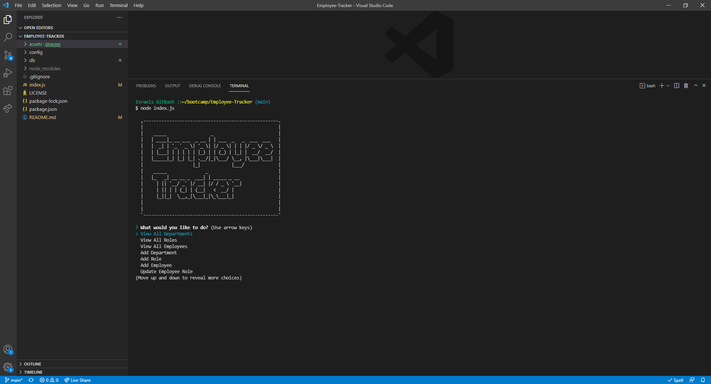
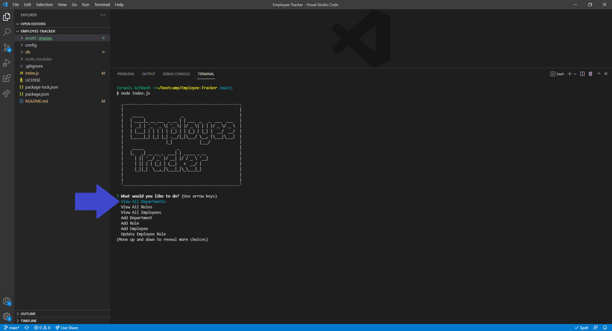
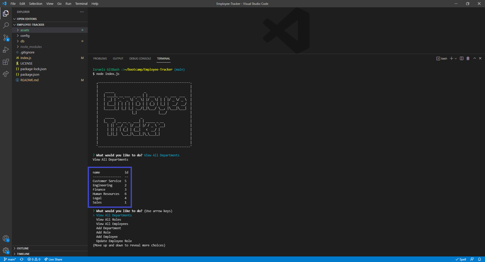
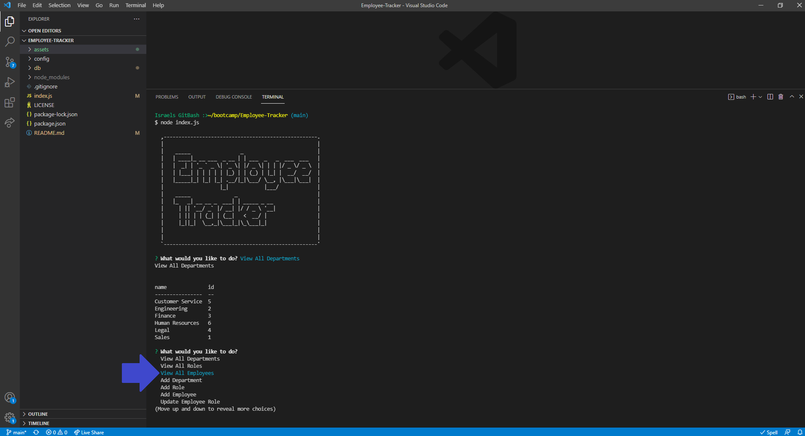
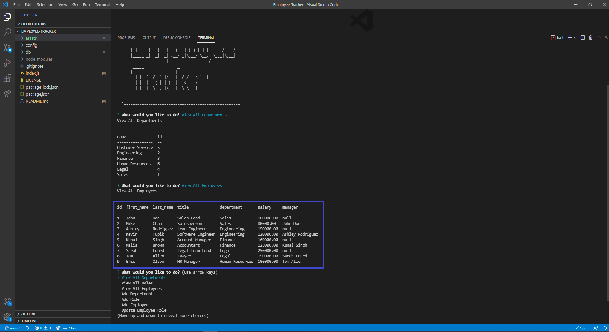
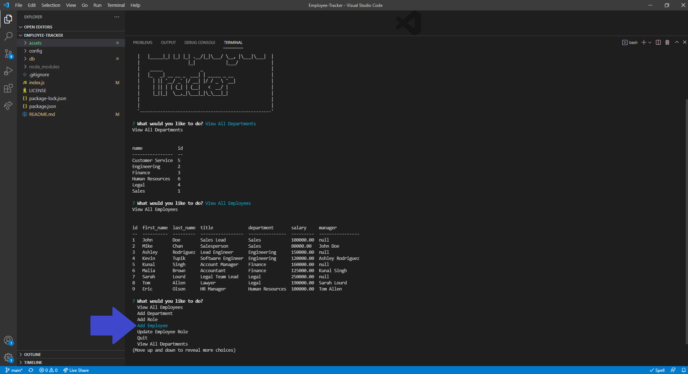
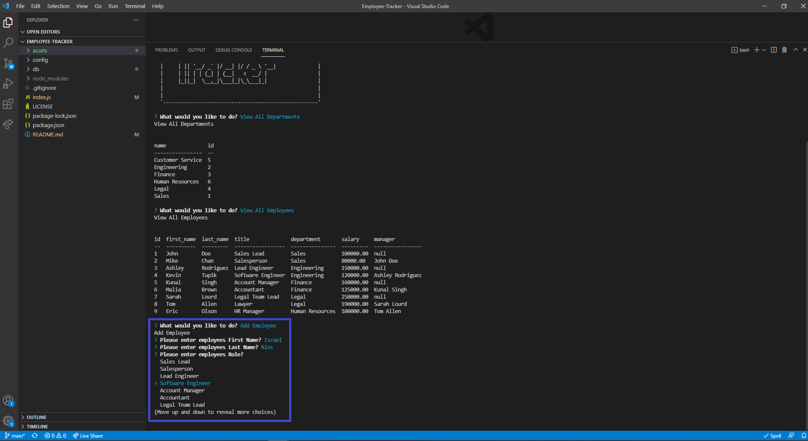
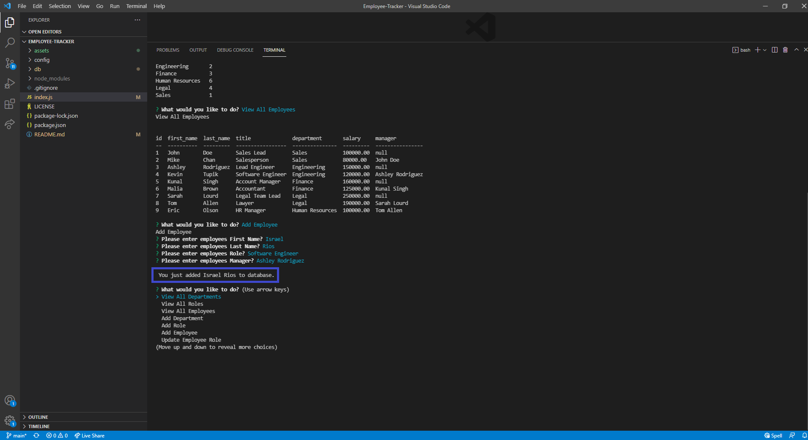

# Employee-Tracker


## Description
This application uses Node.js, Inquirer and MySQL to prompt a series of questions and run queries using the command-line. The application is started when a node command is invoked and the initial prompt asking, "What would you like to do?" displays. This application was created to help small business owners manage and view the departments, roles, and employees in their company.

This project has been one of the most lengthiest assignments we have done, but it has helped me practice creating modular applications. I leared how to use MySQL and different ways to run queries.

## Table of Contents
- [Installation](#installation)
- [Usage](#usage)
- [Contributing](#contributing)
- [Questions](#questions)
- [License](#license)

## Installation
How to install this application and getting started:

* Clone the repo to your local machine
* Open the integrated terminal for the index.js file
* Run `npm install --y` which will install any dependencies

## Usage
You can view a Demo Video showing how to use this application by clicking on this link https://drive.google.com/file/d/1LwI6YyQUPf6ZP_UwgonXO7ZPjYeP5ZmH/view?usp=sharing.

### Step 1
> **Note**: Not all available options and steps will be demonstrated here
* Invoke the following command on your integrated terminal:

```bash
node index.js
```


### Step 2
* After the command has been invoked in the terminal you will see a big logo confirming the Employee Tracker Application has been initiated.



### Step 3
* Using the Up and Down Arrows select "View All Departments"
* You will see a table load with all the Department Names and Department IDs




### Step 4
* Using the Up and Down Arrows select "View All Employees"
* You will see a table load with all the Employee Data including [ID, Name, Title, Department, Salary and Reporting Manager]




### Step 5
* Using the Up and Down Arrows select "Add Employee"
* Enter the First and Last Names of the employee by typing them in
* After entering the name use the Up and Down Arrows to select Role and Manager
* After all the prompts have been answered you will receive a confirmation letting you know the employee has been added to the database




> **Note**: Not all applications options are demonstrated or depicted here

## Contributing
There are many ways in which you can participate in this project, for example:

* Submit bugs and feature requests
* Review source code changes
* Review the documentation and make pull requests for anything from typos to additional and new content

## Questions
To find more information and the repository on this project please visit my [GitHub](https://github.com/israelmrios).

For any additional questions please email me [here](mailto:israelm.riosjr@gmail.com).

## License
Copyright (c) 2021 Israel M Rios.
Licensed under the [MIT License](LICENSE).